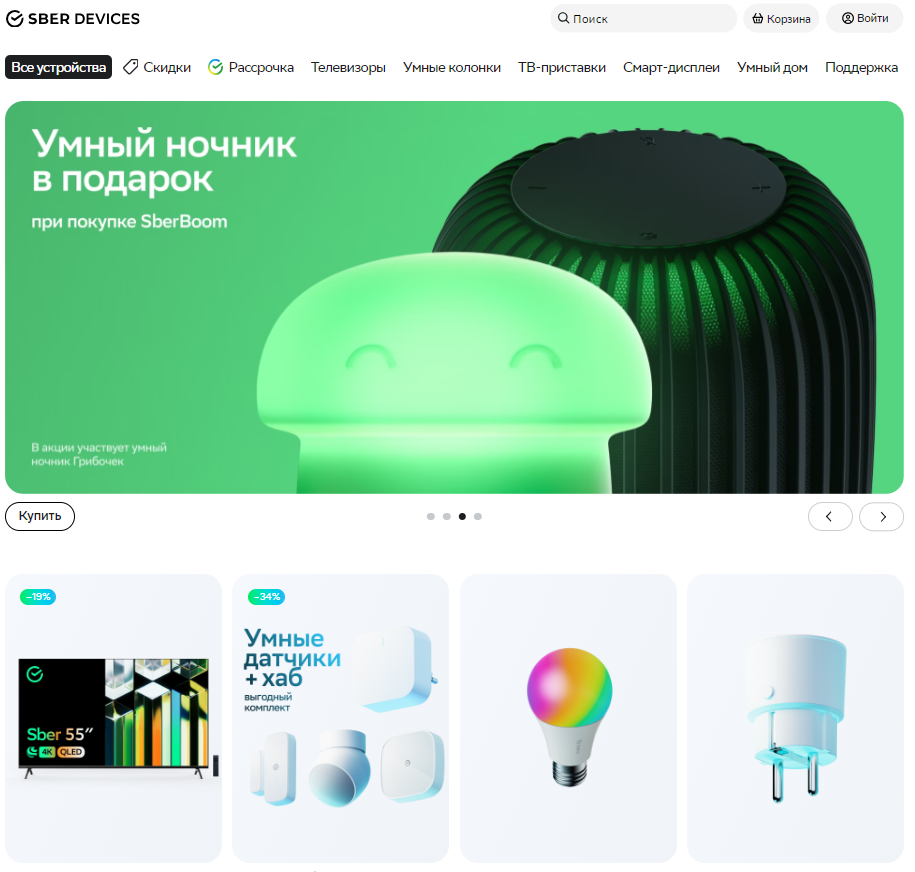
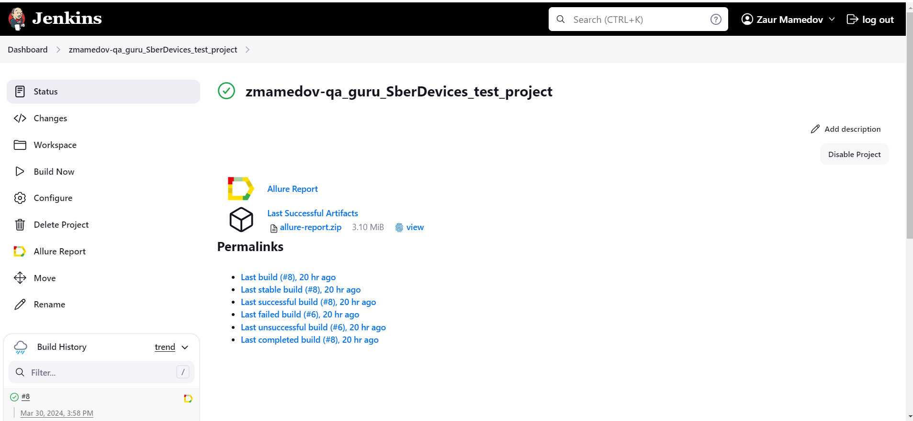
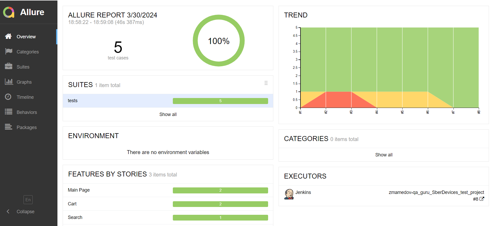
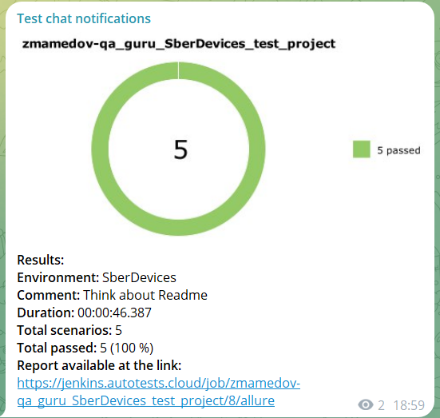
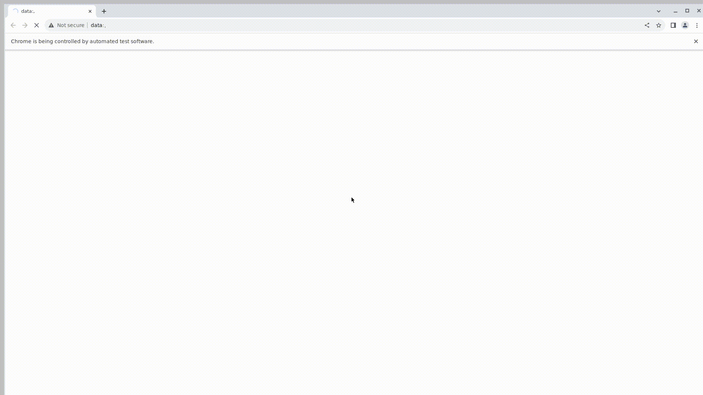

# Проект по тестированию сайта <a target="_blank" href="https://sberdevices.ru/">SBER DEVICES</a>

---
### Список проверок, реализованных в web автотестах
1. Отображение главной страницы сайта.
2. Переход на вкладку "Рассрочка".
3. Возможность поиска нужного товара.
4. Добавление товара в корзину.
5. Очистка корзины.

---

### Используемые инструменты
        

---

### Запуск автотестов осуществляется с использованием Jenkins
> [Ссылка на сборку в Jenkins](https://jenkins.autotests.cloud/job/zmamedov-qa_guru_SberDevices_test_project/)

#### Для запуска автотестов в Jenkins
1. Открыть [задачу в Jenkins](https://jenkins.autotests.cloud/job/zmamedov-qa_guru_SberDevices_test_project/)

2. Нажать "**Build Now**".

---

### Allure отчет

---

### Уведомления в Телеграм

---

### Прохождение автотеста

